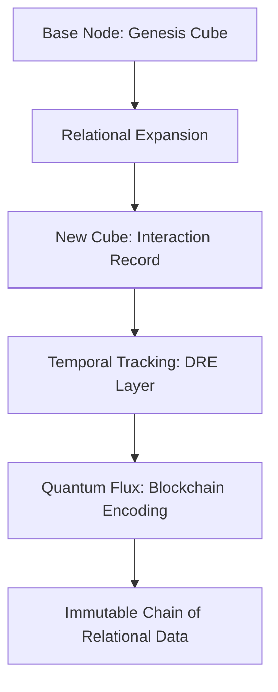

# Unlocking Relational Intelligence with SlappAI
### By Callum Maystone

---

## Abstract

SlappAI represents a seismic shift in data interaction and relational intelligence, driven by cutting-edge innovations like the Relational Intelligence Framework (RIF), ActiveShell, Active Graph Networks (AGN), Cube4D, and Data Relationship Evolution (DRE). By combining intuitive query capabilities, dynamic graph relationships, and multi-dimensional data structures, SlappAI is creating platforms like YouMatter Systems to revolutionize healthcare and other industries.

The YouMatter healthcare platform demonstrates the power of relational intelligence by addressing inefficiencies in patient management through seamless integration of scalable, intelligent systems. Additionally, SlappAI introduces **Quantum Flux**, a blockchain-based mechanism that encodes relational data evolution into secure, immutable chains of information, ensuring traceability, security, and historical integrity. This whitepaper outlines the foundational frameworks, technical architecture, and real-world applications that make SlappAI a game-changing ecosystem. Furthermore, the whitepaper integrates tested Cloud Frameworks, robust CI/CD pipelines, and refined UI/UX principles, ensuring SlappAI remains user-focused, scalable, and technically resilient.

---

## 1. Introduction

### What is SlappAI?
SlappAI is more than a startup—it’s a movement aimed at rethinking how data is accessed, understood, and utilized. By integrating relational intelligence with blockchain technologies like **Quantum Flux**, SlappAI ensures data relationships are encoded with immutability and transparency. At its core, SlappAI builds systems and frameworks that empower industries to transition from static, siloed data to relational intelligence and dynamic interconnectivity.

### **YouMatter Systems: Revolutionizing Healthcare**
Healthcare suffers from inefficiencies caused by outdated Patient Administration Systems (PAS). YouMatter Systems leverages SlappAI’s technology, now enhanced with Quantum Flux, to:

- **Streamline patient management processes:** Immutable, blockchain-encoded records improve data accuracy and reliability.
- **Enhance real-time analytics:** Trace relationships and interactions with historical integrity.
- **Improve scalability and efficiency:** Distributed data frameworks ensure resilience and performance.


### **The Core Objective**
At its heart, SlappAI’s mission is to:

1. Transform how we query and interact with data using ActiveShell.
2. Map complex relationships dynamically through AGNs.
3. Add structured depth to data analytics via Cube4D.
4. Track data evolution over time with DRE, leveraging Quantum Flux for blockchain-based historical integrity.
5. Deliver real-world impact by creating scalable, intuitive platforms like YouMatter Systems.

---

### **Mermaid Diagram Logic**
Here’s a conceptual flow for the diagram:



This diagram illustrates:
1. Base nodes as the starting point for relational data.
2. Expansion into additional cubes with new relationships.
3. Integration with DRE to track temporal changes.
4. Quantum Flux encoding these changes into immutable blockchain chains.


---

## 2. Relational Intelligence Framework (RIF)

### What is RIF?
The Relational Intelligence Framework (RIF) is the cornerstone of SlappAI’s architecture. It redefines how data is structured, interconnected, and analyzed by focusing on relationships rather than isolated data points. RIF empowers systems to:

- Understand the context of data.
- Build dynamic, evolving relationships between nodes.
- Facilitate seamless integration across domains.

### Key Features of RIF
1. **Contextual Awareness:** Enables systems to process and interpret data in relation to its environment.
2. **Dynamic Relationships:** Adapts connections in real time based on evolving data.
3. **Interoperability:** Provides a universal framework for connecting disparate data sources and systems.
4. **Standards Compliance:** Natively supports industry standards such as HL7 and FHIR for seamless integration with healthcare systems.

### Why RIF Matters
Traditional data frameworks are static, relying on rigid schemas that fail to capture the complexity of real-world interactions. RIF breaks these barriers by introducing:

- **Flexibility:** Adapts to changes in data structures without reconfiguration.
- **Scalability:** Supports massive datasets and high-throughput systems.
- **Intelligence:** Builds meaningful connections that drive actionable insights.
- **Healthcare Compatibility:** Ensures compliance with HL7 and FHIR, allowing healthcare providers to integrate RIF into existing workflows effortlessly.

### Placeholder for Visual Representation
**"Active Graph Overview" Image:** A detailed visualization of how RIF operates across multiple dimensions to establish relational intelligence.

---

## 3. ActiveShell: Intuitive Querying for the Future

### What is ActiveShell?
ActiveShell introduces a revolutionary, human-readable query language designed for intuitive interaction with data. By using the Noun-Verb-Truth paradigm, it enables users to extract insights, analyze data, and interact with systems in real-time without requiring deep technical expertise.

### Advanced Querying with ActiveShell

1. **Layered Pipelines:** Combining multiple queries into logical workflows:
   ```shell
   Get-All-Patients |
   Where { $_.BloodPressure -gt 140 -and $_.Age -gt 60 } |
   Sort-By { $_.BloodPressure } |
   Select-Top 10
   ```
   This pipeline identifies the top 10 elderly patients with the highest blood pressure, enabling prioritization of care.

2. **Using `-and` and `-or` Functions:** Flexible condition handling for targeted results:
   ```shell
   Get-All-Transactions |
   Where { ($_.Amount -gt 10000 -and $_.Status -eq "Flagged") -or $_.Source -eq "External" }
   ```
   Detects high-value or flagged transactions, whether internal or external.

3. **Looping Constructs:** Iterative data analysis for enhanced granularity:
   ```shell
   ForEach ($Patient in Get-All-Patients) {
       If ($Patient.BloodPressure -gt 180) {
           Alert-Team "Critical BP Detected for $($Patient.Name)"
       }
   }
   ```
   Automates alerts for patients with critical conditions, enhancing responsiveness.

4. **If-Else Statements:** Logic-driven conditional execution:
   ```shell
   Get-System-Logs |
   ForEach {
       If ($_.ErrorRate -gt 10) {
           Send-Alert "High Error Rate Detected in $($_.Component)"
       } Else {
           Log "System $($_.Component) Operating Normally"
       }
   }
   ```
   Monitors system logs and triggers alerts or logs based on conditions.

### Proactive Anomaly Detection
ActiveShell leverages the principles of RIF and AGNs to proactively identify anomalies in datasets. For example:

- **Outbreak Detection:** Using patient data to identify unusual spikes in symptoms across regions.
  ```shell
  Get-All-Patients |
  Where { $_.Region -eq "Zone5" -and $_.Symptom -like "Flu-like" -and $_.Count -gt 50 }
  ```

- **Infrastructure Issues:** Automatically flagging hardware failures by detecting irregular patterns.
  ```shell
  Get-System-Logs |
  Where { $_.ErrorRate -gt 5 -and $_.Timestamp -within "Last 24 Hours" }
  ```

### Why ActiveShell Matters
1. **Simplified Interaction:** Makes querying accessible to non-technical users.
2. **Real-Time Analysis:** Enables immediate responses to critical data patterns.
3. **Universal Applicability:** Extends across healthcare, finance, IT, and more.
4. **Proactive Intelligence:** Flags issues before they escalate, improving outcomes across domains.
5. **Advanced Logic Capabilities:** Supports complex workflows through pipelines, loops, and conditionals.

---


## 4. Active Graph Networks (AGN): Mapping X and Y Dimensions for Dynamic Relationships


### What is AGN?
Active Graph Networks (AGN) underpin SlappAI’s relational intelligence, enabling dynamic mapping and traversal of relationships across X and Y dimensions. AGNs are designed to capture and analyze data relationships, providing real-time, context-rich insights.

### Key Features
1. **Node-Edge-Node Relationships:** Define entities (nodes) and their interconnections (edges).
2. **Dynamic Traversal:** Adapt connections and relationships based on real-time data changes.
3. **Multi-Domain Relevance:** Operates seamlessly across industries like healthcare, logistics, and finance.

### Depth and Functionality
AGN’s X and Y mapping allows:
- **Bidirectional Traversal:** Both parent and child nodes can query one another dynamically.
- **Relationship Typing:** Differentiates between hierarchical (e.g., Parent-Child) and peer (e.g., Node-to-Node) relationships.
- **Networked Context:** Enables contextual insights by connecting seemingly unrelated nodes through indirect relationships.

### Practical Examples

#### **Healthcare**
- **Patient-Doctor Networks:**
   ```shell
   Map-Relationships |
   Where { $_.Type -eq "PatientToDoctor" -and $_.Duration -lt 6 Months }
   ```
   Use AGNs to track interactions between patients and doctors, identifying gaps in care or areas for follow-up.

- **Hospital-Wide Analytics:**
   ```shell
   Query-Graph |
   Where { $_.NodeType -eq "Department" -and $_.Metrics.Admissions > 1000 }
   ```
   Aggregate departmental performance and discover areas requiring resource reallocation.

#### **Finance**
- **Fraud Ring Detection:**
   ```shell
   Map-Transactions |
   Where { $_.SourceAccount -in "Flagged" -and $_.DestinationAccount -like "High-Risk" }
   ```
   Identify indirect relationships that connect seemingly unrelated fraudulent transactions.

- **Credit Scoring Systems:**
   ```shell
   Map-Nodes |
   Where { $_.Type -eq "Borrower" -and $_.RiskFactor > 0.8 }
   ```
   Analyze borrower networks and detect high-risk patterns to adjust credit scoring algorithms.

#### **Logistics**
- **Global Shipping Routes:**
   ```shell
   Map-Paths |
   Where { $_.Hub -eq "Asia" -and $_.Traffic.Load > 80% }
   ```
   Visualize congestion in major hubs and optimize shipment rerouting dynamically.

- **Supplier Networks:**
   ```shell
   Map-Network |
   Where { $_.NodeType -eq "Supplier" -and $_.DeliveryDelays > 3 }
   ```
   Analyze supplier networks for performance issues, enabling proactive risk mitigation.

#### **Retail**
- **Product Correlation Analysis:**
   ```shell
   Map-Sales |
   Where { $_.Product -like "*Electronics" -and $_.SalesRegion -eq "North America" }
   ```
   Use AGNs to discover relationships between product sales and regional purchasing trends.

- **Customer Behavior Mapping:**
   ```shell
   Query-Customers |
   Map-Relationships |
   Where { $_.Spending > 1000 -and $_.LoyaltyStatus -eq "Gold" }
   ```
   Create targeted marketing strategies by identifying high-value customer clusters.

#### **Energy and Utilities**
- **Grid Failure Analysis:**
   ```shell
   Query-Network |
   Where { $_.Type -eq "Substation" -and $_.ErrorRate > 5 }
   ```
   Map cascading failures across interconnected substations to prevent outages.

- **Renewable Energy Distribution:**
   ```shell
   Map-Graph |
   Where { $_.Node -eq "Solar Plant" -and $_.Distribution > 80% }
   ```
   Monitor renewable energy contributions and optimize grid balance.

### Why AGNs Matter
1. **Contextual Insights:** Discover patterns that traditional databases overlook.
2. **Scalable Intelligence:** Handle vast networks of relationships with ease.
3. **Cross-Domain Relevance:** Apply the same principles to healthcare, finance, IT, and beyond.
4. **Real-Time Adjustments:** Enable dynamic decision-making across systems.


---

## 5. Cube4D: Adding Depth Through Structured Z-Dimensional Data

### What is Cube4D?

Cube4D enhances Active Graph Networks (AGNs) by introducing a Z-dimension, enabling hierarchical structuring, relational depth, and in-depth data analysis. By organizing multi-faceted data points, Cube4D allows for seamless traversal between layers and facilitates dynamic interactions across datasets. This system mirrors the concept of **perfect cubes**, where balanced relationships across X, Y, and Z dimensions (+1 as a scaling factor) create a framework for managing and evolving relational data at scale.


*This image illustrates the hierarchical depth capability of Cube4D, showing structured layers across the Z-dimension for enhanced data analysis.*

---

### Key Features

1. **Hierarchical Depth:** Adds a third dimension for detailed data analysis. This depth allows users to traverse seamlessly between high-level overviews and granular details. For instance:
   - In **healthcare**, hospital administrators can visualize system-wide metrics and zoom into specific patient records.
   - In **logistics**, warehouse managers can analyze regional stock levels while investigating SKU performance within a specific location.
   
2. **Cross-Domain Scalability:** Cube4D adapts to various industries, including finance, retail, logistics, and education, enabling relational intelligence across disciplines.

3. **Spreadsheet Integration:** The integration with Excel-like interfaces bridges conceptual models with actionable data. These interfaces allow analysts to interact dynamically with Cube4D’s underlying structure, blending familiarity with innovation.

4. **Cube Stacking:** Cube Stacking facilitates hierarchical queries across interrelated datasets, unlocking insights from layered data relationships.

---

### Depth and Functionality

Cube4D empowers:
- **Hierarchical Navigation:** Traverse datasets from a macro perspective (e.g., national performance) to micro details (e.g., individual record audits).
- **Temporal Context:** Integrate Z-dimensional data with Data Relationship Evolution (DRE) for insights tied to specific timeframes or trends.
- **Multi-Source Integration:** Consolidate datasets from disparate sources, preserving relational integrity.


*This diagram demonstrates Cube Stacking in Cube4D, where data is layered to enable dynamic, multi-dimensional querying.*


*Here, the temporal context of Cube4D is showcased, integrating Z-dimensional data with DRE to track state changes and time-based insights.*

---

### Explaining the Screenshots

#### **Perfect Numbers and Scaling**
The comparison with **perfect numbers** demonstrates the proportional scaling of Cube4D, where relational dimensions maintain equilibrium for optimal traversal and insight generation. Each perfect cube represents a self-consistent system capable of supporting dynamic growth while preserving structure.

#### **Layered Data Navigation**
The layered table graphic exemplifies Cube4D’s ability to organize data relationally. For example:
- **Input/Output Dynamics:** The table maps nodes (inputs) and their outputs through hierarchical relationships, demonstrating Cube4D’s relational intelligence.
- **Bit-Level Precision:** Cube4D encodes relationships at the binary level, ensuring scalability and computational efficiency.

#### **Binary Computation and AGNs**
The Active Graph Networks (AGN) integration ensures efficient computation by structuring data relationships in binary. The example “Get-Patient-Record” command demonstrates Cube4D’s computational precision:
- **Binary Mapping:** Each bit specifies node location, temporal context, and relational depth, enabling real-time, precise queries.
- **Real-World Example:** A healthcare system retrieves patient data through hierarchically encoded relationships, reducing overhead and improving accuracy.

---

### Example Use Cases

1. **Healthcare**
   - Identify treatment trends across facilities:
     ```shell
     Query-Cube |
     Where { $_.Dimension.Z -eq "TreatmentMetrics" -and $_.Outcomes -eq "Successful" }
     ```
   - Track historical medication patterns:
     ```shell
     Query-Cube |
     Where { $_.Dimension.Z -eq "MedicationHistory" -and $_.PatientID -eq "P123" }
     ```

2. **Logistics**
   - Optimize warehouse management:
     ```shell
     Query-Cube |
     Where { $_.Dimension.Z -eq "Inventory" -and $_.StockLevel -lt 50 }
     ```
   - Monitor delivery chains:
     ```shell
     Query-Cube |
     Where { $_.Dimension.Z -eq "ShippingRoutes" -and $_.Delays > 5 }
     ```

3. **Education**
   - Assess performance metrics:
     ```shell
     Query-Cube |
     Where { $_.Dimension.Z -eq "TestScores" -and $_.Region -eq "District5" }
     ```
   - Forecast resource needs:
     ```shell
     Predict-Cube |
     Where { $_.Dimension.Z -eq "Resources" -and $_.Growth > 5% }
     ```


---

## 6. Data Relationship Evolution (DRE): Tracking State Changes Over Time

### What is DRE?
DRE is the temporal layer of Cube4D, designed to track and analyze state changes in data relationships over time. This enables SlappAI to provide historical insights and predictive analytics.

### Key Features
1. **Temporal Insights:** Tracks data evolution over time for compliance and trend analysis.
2. **Predictive Analytics:** Forecasts future outcomes based on historical patterns.
3. **State Transition Mapping:** Visualizes how relationships evolve between states.

### Depth and Functionality
DRE tracks:
- **Event Chaining:** Links sequential events across time to understand causality.
- **Stateful Data Evolution:** Records changes in attributes, relationships, and metrics.
- **Predictive Modelling:** Leverages past patterns to simulate future scenarios.

### Example Use Case
- **Healthcare:** Track patient medication history.
   ```shell
   Track-DataEvolution |
   Where { $_.Dimension.T -eq "MedicationChanges" -and $_.PatientID -eq "P1" }
   ```
- **Finance:** Monitor flagged transaction trends over time.
   ```shell
   Analyze-Transactions |
   Track-Evolution |
   Where { $_.T -eq "Last 30 Days" -and $_.Status -eq "Flagged" }
   ```

---

## 7. Quantum Flux: Blockchain-Powered Relational Integrity

### What is Quantum Flux?
Quantum Flux is a blockchain-based layer integrated into SlappAI’s ecosystem, designed to encode relational data into immutable chains. It ensures data integrity, transparency, and traceability, making it a cornerstone of modern relational intelligence.

### Key Features
1. **Immutable Chains:** Relational data and its evolutionary history are secured in tamper-proof blocks.
2. **Decentralized Architecture:** Eliminates single points of failure, distributing trust across nodes.
3. **Relational Encoding:** Tracks connections and interactions between nodes as linked blockchain blocks.
4. **Historical Integrity:** Provides a transparent audit trail for compliance and analysis.

### Depth and Functionality
Quantum Flux enhances SlappAI’s frameworks by:
- **Linking Cubes:** Each data relationship or state change generates a new blockchain block linked to its predecessor, forming a cube chain.
- **Temporal Integration:** Seamlessly integrates with DRE to record and visualize data evolution over time.
- **Cross-Domain Utility:** Applies to industries needing high-trust systems, such as healthcare, finance, and logistics.

### Practical Examples
- **Healthcare:** Immutable patient records ensure secure cross-hospital data sharing.
   ```shell
   Encode-Node "PatientRecord" |
   Track-Evolution |
   Where { $_.TimeStamp -between "2024-01-01" and "2025-01-01" }
   ```

- **Finance:** Transparent transaction histories prevent fraud.
   ```shell
   Encode-Transaction |
   Where { $_.Status -eq "Flagged" }
   ```

- **Logistics:** Decentralized supply chain tracking prevents counterfeiting.
   ```shell
   Encode-Node "Shipment" |
   Track-Path |
   Where { $_.NodeType -eq "Supplier" -and $_.Location -like "Port" }
   ```

### Why Quantum Flux Matters
1. **Enhanced Security:** Ensures relational data is tamper-proof and secure.
2. **Transparency:** Builds trust with immutable data histories.
3. **Future-Proofing:** Prepares SlappAI for blockchain-driven industries and decentralized systems.


---

## 8. Applications: Real-World Use Cases in Healthcare and Beyond

### Healthcare
- **Patient Record Access:** Simplify access to patient records with intuitive queries.
   ```shell
   Get-All-Patients |
   Where { $_.Condition -eq "Diabetes" -and $_.LastVisit -gt "2024-12-01" }
   ```
- **Anomaly Detection:** Identify irregularities in patient data.
   ```shell
   Get-All-Patients |
   Where { $_.Region -eq "Zone5" -and $_.Symptom -like "Fever" -and $_.Count -gt 20 }
   ```

### Finance
- **Fraud Detection:** Flag suspicious transactions dynamically.
   ```shell
   Get-All-Transactions |
   Where { $_.Amount -gt 10000 -and $_.Status -eq "Flagged" }
   ```
- **Predictive Analytics:** Model trends for financial forecasting.
   ```shell
   Analyze-Transactions |
   Predict-Node |
   Where { $_.Trend -eq "Upward" }
   ```

### Logistics
- **Route Optimization:** Streamline delivery using traffic and ETA data.
   ```shell
   Map-Routes |
   Where { $_.Traffic -eq "Low" -and $_.ETA -lt 30 }
   ```
- **Inventory Management:** Monitor stock dynamically across hierarchies.
   ```shell
   Query-Cube |
   Where { $_.Dimension.Z -eq "Inventory" -and $_.StockLevel -lt 5 }
   ```

---

## 9. Scalability with Robust Cloud Architecture

#### **Cloud-First Design for Scalability**
SlappAI's cloud-native architecture ensures that the platform is scalable, resilient, and secure. By leveraging Microsoft Azure's services and frameworks, the platform supports high-performance workloads, dynamic scaling, and multi-layered security.

#### **Cloud Architecture Overview**
The SlappAI ecosystem is built using a layered Azure-based architecture:

1. **Azure Front Door** ensures secure and distributed traffic routing.
2. **Azure Web Application Firewall** (WAF) protects against web-based attacks.
3. **YouMatter Web App** serves as the core UI/UX layer, processing user requests.
4. **Azure API Management** connects APIs securely while enabling rate-limiting and monitoring.
5. **BePatientAPI Function App** ensures scalable serverless functions for dynamic compute needs.
6. **Azure Blob Storage** supports unstructured data storage.
7. **Azure Cosmos DB** enables globally distributed, low-latency data storage for relational intelligence.
8. **Azure Monitor & Application Insights** ensure real-time monitoring and troubleshooting.
9. **Azure Key Vault** secures sensitive data, such as API keys and secrets.

---

#### **IAM and Role-Based Security**

##### **Identity and Access Management (IAM) Principles**
IAM ensures that only authorized users can access specific resources or perform designated actions. SlappAI employs a multi-tiered security strategy:

1. **Role-Based Access Control (RBAC):** Assigns roles like "Doctor," "Nurse," and "Admin" based on job functions.
2. **Policy-Based Access Control (PBAC):** Adds conditional rules for granting access, such as time of day or user location.
3. **Attribute-Based Access Control (ABAC):** Evaluates contextual attributes (e.g., department or patient record type).

---

#### **Integration of RBAC and Cloud Security**
The platform uses Azure Active Directory (Azure AD) for identity verification and secure token issuance. A sequence diagram outlines this process:

1. User authentication flows through Azure AD.
2. Authorization tokens enable access to the **YouMatter Web App** and backend services.
3. Fine-grained policies validate access levels before data is retrieved.


_This diagram illustrates Azure AD's token issuance workflow for secure authentication_


_This info-sheet provides context about how YouMatter leverages RBAC, ABAC and PBAC for Data Security, Integrity and Compliance_


---

#### **Enhanced Scalability through Cloud Services**

**Key Scalability Features:**

1. **Dynamic Resource Allocation:**
   Azure Auto-Scaling dynamically adjusts resources based on user demand, ensuring performance under heavy workloads.

2. **Geo-Distributed Data Storage:**
   Azure Cosmos DB provides globally distributed data storage with low-latency performance, supporting SlappAI's relational intelligence across regions.

3. **Efficient API Management:**
   Azure API Management enables API versioning, load balancing, and real-time monitoring, ensuring consistent API performance.

4. **Serverless Compute with Azure Functions:**
   By using the BePatientAPI Function App, SlappAI offloads compute-intensive tasks to serverless functions, reducing costs and improving performance.


_This Diagram explains how Data Flows through SlappAI's, Showcasing it's Scalable, Intelligent Cloud Arcitecture_


---

### Additions to Scalability Use Cases

#### **Healthcare:**
- High-concurrency patient record queries.
  ```shell
  Query-Cube |
  Where { $_.RBAC -eq "Doctor" -and $_.TimeStamp -gt "2024-12-01" }
  ```

#### **Logistics:**
- Global shipment tracking with Cosmos DB.
  ```shell
  Map-Nodes |
  Where { $_.Region -eq "Asia" -and $_.NodeType -eq "Supplier" }
  ```

#### **Finance:**
- Real-time fraud detection using serverless APIs.
  ```shell
  Analyze-Transactions |
  Where { $_.Amount -gt 10000 -and $_.Status -eq "Flagged" }
  ```

---

### **Why Cloud Architecture Matters**

1. **Security-First Design:** Multi-layered IAM controls and encrypted communication protocols.
2. **Global Reach:** Distributed data services ensure reliability and low-latency performance across regions.
3. **Cost Optimization:** Pay-per-use models and serverless compute reduce operational costs.
4. **Flexibility:** Azure’s modular services enable rapid adaptation to new requirements or increasing demands.

---

This refactored structure integrates the diagrams and cloud architecture context while providing logical depth. Let me know if you'd like me to adjust or expand on specific areas!


---

## 10. Conclusion: Why SlappAI is the Future

### A Paradigm Shift in Data Intelligence
SlappAI redefines how industries approach data, shifting from isolated silos to interconnected, dynamic intelligence. Its core frameworks—AGN, Cube4D, DRE, and ActiveShell—empower organizations to harness the full potential of relational intelligence.

### Why It Matters
1. **Universal Applicability:** From healthcare to finance and beyond, SlappAI adapts seamlessly to any domain.
2. **Real-Time Insights:** Enables immediate, actionable decisions through intuitive queries and dynamic relationships.
3. **Future-Proof Design:** Built to scale with growing datasets, evolving relationships, and new dimensions of data.
4. **Empowerment Through Simplicity:** ActiveShell makes complex data interactions accessible to all users, from analysts to decision-makers.

### The Road Ahead
SlappAI is more than a toolset—it’s a movement. By fostering a future where data relationships are understood, acted upon, and evolved in real-time, SlappAI positions itself as the cornerstone of modern data intelligence. Industries that adopt its frameworks will lead the charge into a new era of efficiency, insight, and innovation.

Join us in unlocking the power of relational intelligence. The future is now—and it’s powered by SlappAI.

